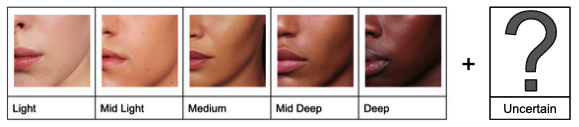
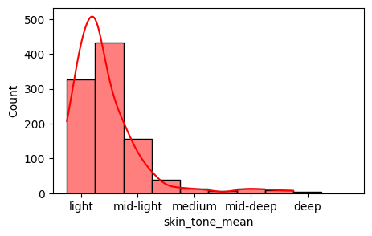
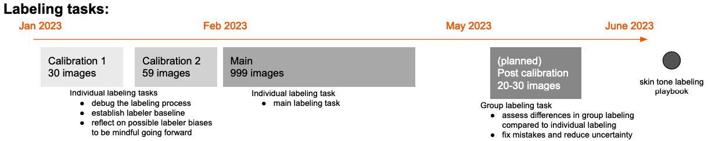
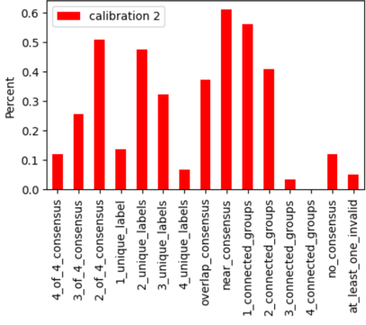
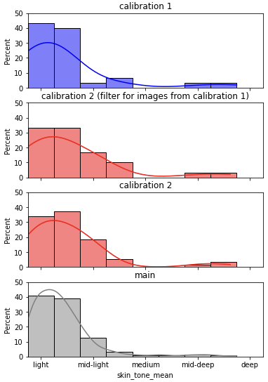

# Skin Tones Data Documentation

Data documentation contributions and feedback are welcome!

## Overview

### Primary Data Modality
<!-- scope: telescope -->
<!-- info: Select the modality(ies) that best describe a typical data point 
(see http://www.trustworthymachinelearning.com/trustworthymachinelearning-04.htm, 
section 4.1, for a definition of data modality): -->
- Image Data
- Tabular Data

### Dataset Description

*Post hoc* skin tone labels of the faces of customers in the [Zalando Voice of Customer (VOC) dataset](https://docs.google.com/document/d/15Agfx3jpiYHLjssztqZMWl-JtxRDhXfV5BT4ZZXfOcs)
curated as part of the ["Skin Tone Labeling Initiative."](https://docs.google.com/document/d/12wYbrM9dHFXapbeBPZxX3Yh6mvYSzskQs1nmWrlt-Lk/edit#heading=h.va8flzlzpc8h)
The primary purpose of this data is for fairness evaluation purposes:

- to help ensure data used to train ML/AI systems for Size and Fit is representative of Zalando's customers
- to ensure ML/AI systems do not systematically underperform for customers with certain skin tones

(see [Known Dataset Usage - Known Dataset Usage](#known-usage) for more information about known fairness 
evaluations implemented using this dataset).

This data was collected by a team of four Zalando labelers from a mix of teams including
Beauty, Size and Fit, and Algorithmic Privacy and Fairness.  Labelers followed specific
[Skin Tone Labeling Instructions](https://docs.google.com/document/d/1o56MdP7yFW9aWcLgPu0pbV3fuoWIrHntZ2Dx4AiCRFE/edit),
and labeled each image for skin tone based on the 
[2022 Zalando Beauty skin tone scale](https://www.figma.com/file/XiG4sHJbr8YNNoVUObAcPC/Beauty-Advice---Phase-2?node-id=5208%3A69268&t=yFlqy40lkT8sEvVd-0)
(shown below).



Further technical details can be found in the [Skin Tone Labeling GitHub Repository](https://github.bus.zalan.do/aithics/skin-tone-labeling).

Special thanks to the labelers:

- **[Alex Loosley](mailto:alex.loosley@zalando.de)**, Algorithmic Privacy and Fairness
- **[Gunay Kazimzade](mailto:gunay.kazimade@zalando.de)**, Algorithmic Privacy and Fairness
- **[Amrollah Seifoddini](mailto:amrollah.seifoddini@zalando.ch)**, Size and Fit
- **[Andra Magerusan](mailto:andra.magerusan@zalando.ch)**, Beauty


Beyond fairness evaluations, this dataset along with the entire initiative has inpired the creation of a
Zalando Skin Tone Labeling Playbook.

### Status
<!-- scope: telescope -->
<!-- info: Select **one:** -->

**Status Date:** 27/04/2023

**Under Preparation** - The dataset is still under active curation
and is not yet ready for use due to active "dev" updates.  The dataset should be
ready for wider usage in June 2023.

### Relevant Links
<!-- info: Provide a quickly accessible list of relavent links: -->
<!-- width: full -->

* [Zalando VOC Skin Tones Dataset](https://s3.console.aws.amazon.com/s3/buckets/skin-tone-labeling?region=eu-central-1&tab=objects)
(S3 Bucket requiring access permissions)
* [Zalando VOC Images Data Documentation](https://docs.google.com/document/d/15Agfx3jpiYHLjssztqZMWl-JtxRDhXfV5BT4ZZXfOcs/edit) (Base dataset used for labeling)
* [Skin Tone Labeling Initiative](https://docs.google.com/document/d/12wYbrM9dHFXapbeBPZxX3Yh6mvYSzskQs1nmWrlt-Lk/edit#heading=h.va8flzlzpc8h)
* [Instructions for Labelers](https://docs.google.com/document/d/1o56MdP7yFW9aWcLgPu0pbV3fuoWIrHntZ2Dx4AiCRFE/edit)
* [Dataset processing and analysis](https://github.bus.zalan.do/aithics/skin-tone-labeling/) (GitHub Repository)

### Developers
- **[Alex Loosley](mailto:alex.loosley@zalando.de), Algorithmic Privacy and Fairness:** (Principle Developer)
- **[Amrollah Seifoddini](mailto:amrollah.seifoddini@zalando.ch), Size and Fit:** (Dataset Owner)

### Owner
- **Main point of contact:** [Amrollah Seifoddini](mailto:amrollah.seifoddini@zalando.ch)
- **Team:** [Size and Fit](mailto:team-sizing@zalando.de) (Zurich)
- **Affiliation:** Zalando SE
- **Team Website:** N/A

### Data Subject(s)
<!-- scope: telescope -->
<!-- info: Select ***all applicable**** subjects contained the dataset: -->
- Images of consenting customers
- Sensitive Data about people
- Skin tones labels

### Data Point Description
<!-- scope: microscope -->
<!-- info: Provide a short description of the content in a data point: -->

A data point is made up of an image of a person, and one or more skin tone labels as defined in this
[Instructions for Labelers](https://docs.google.com/document/d/1o56MdP7yFW9aWcLgPu0pbV3fuoWIrHntZ2Dx4AiCRFE/edit)
document.

See the [Examples of Data Points](#example-of-data-points) section for examples.

### Dataset Statistics
<!-- scope: periscope -->
<!-- info: Provide a statistics of the dataset:<br><br>(Add or remove fields
based on common sense about which are most useful for consumers to see at a glance.
Use the additional notes to include relevant information, considerations,
and links to table(s) with more detailed breakdowns.) -->

| Category              | Data                                |
|-----------------------|-------------------------------------|
| Size of Dataset       | 1009 MB                             |
| Number of Data Points | 59 calibration + 999 main           |
| Label Classes         | 6 (5 skin tones, 1 for uncertainty) |
| Type of labels        | Multiple labels per data point      |
| Algorithmic Labels    | 0                                   |
| Human Labels          | All                                 |

**Additional Notes:** The definitions of main and calibration splits and information on labels can be found in 
the [Human Annotation - Annotation Tasks](#annotation-tasks) section.

### Tables and Fields
<!-- width: full -->
<!-- scope: microscope -->
<!-- info: List the dataset fields and their descriptions.
For `Type` use [python typing standards](https://docs.python.org/3/library/typing.html).-->

#### TABLE: labels_per_image
<!-- width: full -->
- **Primary Key:** `annotation_image_id`
- **Description:** Skin tone label data for each image.


| Field Name             | Type            | Description                                                                                                                                                                    |
|------------------------|-----------------|--------------------------------------------------------------------------------------------------------------------------------------------------------------------------------|
| annotation_image_id    | str             | Primary key identifying image with respect to annotation job                                                                                                                   |
| labels                 | list[list[str]] | List of multiple labels (inner lists) given by each labeler (outer list)                                                                                                       |
| skin_tone_values       | list[float]     | Skin tone values for each labeler (based on [ZBeautySkinToneLabelEncoder](https://github.bus.zalan.do/aithics/skin-tone-labeling/blob/main/skin_tone/encoders/zbeauty.py#L22)) |
| valid_skin_tone_values | list[float]     | Same as skin tone values with invalid value floats removed                                                                                                                     |
| skin_tone_mean         | float           | Mean valid skin tone value                                                                                                                                                     |
| skin_tone_std          | float           | Standard deviation of valid skin tone values                                                                                                                                   |

| Statistic | skin_tone_mean |
|-----------|----------------|
| count     | 999            |
| mean      | 0.670921       |
| std       | 0.629619       |
| min       | 0.             |
| 25%       | 0.25           |
| 50%       | 0.5            |
| 75%       | 0.75           |
| max       | 4.             |
| mode      | 0.5            |

Histogram of `skin_tone_mean` values:



**Additional Notes:** Skin tone related labels and values are protected attributes,
see the [sensitive and protected attributes](#sensitive-and-protected-attributes) section
for more details.

---
#### TABLE: labeling_job_manifest
<!-- width: full -->
- **Primary Key:** `image_id`
- **Description:** Annotation job manifest, containing information about what was annotated.


| Field Name          | Type | Description                                 |
|---------------------|------|---------------------------------------------|
| image_id            | str  | Unique image id                             |
| annotation_image_id | str  | image id given corresponding annotation job |
| source-ref          | str  | s3 bucket location                          |

---
#### TABLE: data_per_label
<!-- width: full -->
- **Primary Key:** None
- **Description:** Information about each label, such as a labeler UUID and meta data like how much time was needed to
  produce the label.


| Field Name          | Type  | Description                                         |
|---------------------|-------|-----------------------------------------------------|
| annotation_image_id | str   | links to `image_id` in `labels_per_image` table     |
| workerId            | str   | unique id of worker (labeler) who labeled the image |
| timeSpentInSeconds  | float | time needed for labeler to label the image          |

### Dataset Version and Maintenance

#### Version Details
<!-- scope: periscope -->
<!-- info: Provide details about the current data version
and which data version the current data card corresponds to.

For datasets without version number, use "Not currently tracked"
but be sure to track the release date of the data.

```
**Current Data Version:** Not currently tracked

**Data Version Release Date:** 05/03/2023

**Data Version for last Data Card Update:** N/A

**Last Data Card Update:** 10/03/2023
```
-->
**Current Data Version:** Not currently tracked

**Data Version Release Date:** 03/03/2023

**Data Version for last Data Card Update:** N/A

**Last Data Card Update:** 10/03/2023

#### Data Change Log
<!-- scope: periscope -->
TBD

#### Maintenance Plan
<!-- scope: microscope -->
<!-- info: Summarize the maintenance plan for the dataset:

Use additional notes to capture any other relevant information or
considerations. -->
This dataset is in development mode and not yet being maintained for usage by others.

**Versioning:** TBD

**Updates:** TBD

**Errors:** TBD

**Feedback:** TBD

#### Next Planned Update(s)
<!-- scope: periscope -->
<!-- info: Provide details about the next planned update:
For datasets that are not currently version controlled or
under active development that are not yet stable,
this section could be filled in as follows:

```
**Version affected:** Not currently tracked

**Next data update:** Ongoing until version 1.0.0 released

**Next version:** 1.0.0

**Next version update:** 04/2029 (expected first stable dataset release,
                                  ie. version 1.0.0)

```
-->
**Version affected:** Not currently tracked

**Next data update:** Ongoing until version 1.0.0

**Next version:** 1.0.0

**Next version update:** 04/2023

#### Expected Change(s)
<!-- scope: microscope -->
<!-- info: Summarize the updates to the dataset and/or data that are expected
on the next update.

Use additional notes to capture any other relevant information or
considerations. -->
Version 1.0.0 will be released once data curation and preparation is complete.


## Example of Data Points
#### Typical Data Point
<!-- width: half -->
<!-- info: Provide an example of a typical data point and describe what makes
it typical.

**Use additional notes to capture any other relevant information or
considerations.** -->
A typical annotation example from the `labels_per_image` table:

```json
{"annotation_image_id": "10",
 "skin_tone_values": [3.5, 3.5, 3.0, 3.0],
 "labels": [["mid-deep", "deep"],
  ["mid-deep", "deep"],
  ["mid-deep"],
  ["mid-deep"]],
 "uncertain_labels": [false, false, false, false],
 "valid_skin_tone_values": [3.5, 3.5, 3.0, 3.0],
 "any_uncertainty": false,
 "complete_consensus": false,
 "overlap_consensus": true,
 "near_consensus": true,
 "n_skin_tone_values": 4,
 "frac_unique_values": 0.5,
 "n_unique_skin_tone_values": 2,
 "n_connected_skin_tone_groups": 1,
 "skin_tone_mean": 3.25,
 "skin_tone_std": 0.25,
 "has_invalid_annotation": false,
 "skin_tone_mode_value": 3.0,
 "skin_tone_mode_count": 2,
 "n_valid_labels": 4}
```

Here, annotators were not uncertain in their labels, two believed the skin tone was a combination of
`mid-deep` and `deep`, and two thought the skin tone was just `deep` (note neighbouring skin-tone labels 
like `mid-deep` and `deep` were allowed, see [Annotations and Labling](#annotations-and-labeling) 
for more details).

Note, this data corresponds to the main labeling task which only had three labelers. See 
[Annotations and Labeling](#annotations-and-labeling) for more details about labeling tasks.

#### Atypical Data Point
<!-- width: half -->
<!-- info: Provide an example of an outlier data point and describe what makes
it atypical.

**Use additional notes to capture any other relevant information or
considerations.** -->
An atypical annotation example from the `labels_per_image` table where
the first labeler seemed to have made a mistake by labeled a skin tone as both `light` and `deep`:

```json
{"annotation_image_id": "24",
 "skin_tone_values": [-1.0, 1.5, 0.0],
 "labels": [["light", "deep"], ["mid-light", "medium"], ["light"]],
 "uncertain_labels": [false, false, false],
 "valid_skin_tone_values": [1.5, 0.0],
 "any_uncertainty": false,
 "complete_consensus": false,
 "overlap_consensus": false,
 "near_consensus": false,
 "n_skin_tone_values": 2,
 "frac_unique_values": 1.0,
 "n_unique_skin_tone_values": 2,
 "n_connected_skin_tone_groups": 2,
 "skin_tone_mean": 0.75,
 "skin_tone_std": 0.75,
 "has_invalid_annotation": true,
 "skin_tone_mode_value": 0.0,
 "skin_tone_mode_count": 1}
```

Note, this data corresponds to the calibration 1 labeling task which had more labeling mistakes as labelers 
got used to the labeling UI.  See [Annotations and Labeling](#annotations-and-labeling) for more details about
labeling tasks.

#### Sampling of Data Points
<!-- scope: periscope -->
<!-- info: Provide link(s) to data points OR
a link to an exploratory demo if one exists -->

<table>
    <thead>
        <tr>
            <th>Example Type</th>
            <th>annotation_image_id</th>
            <th>Apparent skin tone</th>
        </tr>
    </thead>
    <tbody>
        <tr>
            <td rowspan=2>human labelers agreed on labels</td>
            <td>10</td>
            <td>lighter</td>
        </tr>
        <tr>
            <td>15</td>
            <td>deeper</td>
        </tr>
        <tr>
            <td rowspan=2>human labelers were uncertain about label</td>
            <td>14</td>
            <td>lighter</td>
        </tr>
        <tr>
            <td>255</td>
            <td>deeper</td>
        </tr>
    </tbody>
</table>

**Additional Note**: No actual images can be shown here because they require access approval 
(see [Access section](#access)). 


## Purpose and Motivations
<!-- info: This section focuses on the initial reasons why the
dataset was curated / created, and should be written from the point
of view of the dataset developers before and during its creation.

For current usage guidelines, see the section.
-->

### Intended Purpose(s)
<!-- scope: telescope -->
<!-- info: Select the original intended purposes of creating or
curating this dataset-->
- Fairness Evaluation

### Motivating Factor(s)
<!-- scope: microscope -->
<!-- info: List the primary motivations for creating or curating this dataset:

(Usage Note: use this to describe the problem space and corresponding
motivations for the dataset.) -->
- Assessing and publishing the distribution of skin tones in the [Zalando VOC dataset](https://docs.google.com/document/d/15Agfx3jpiYHLjssztqZMWl-JtxRDhXfV5BT4ZZXfOcs/edit)
- Identifying potential sample bias in data that may be used for training computer vision systems at Zalando
- Providing a skin tone dataset for fairness evaluation
- Writing a [skin tone labeling playbook](https://github.bus.zalan.do/aithics/skin-tone-labeling/tree/main/playbook) for others who want to curate skin tones via *post hoc* human labeling

See the [skin-tone-labeling](https://github.bus.zalan.do/aithics/skin-tone-labeling) repository for more details.

### Intended Use
#### Dataset Use(s)
<!-- scope: telescope -->
<!-- info: Select **one**: -->
- Skin tone fairness evalaution for pre-production models

#### Suitable Use Case(s)
<!-- scope: periscope -->
<!-- info: Summarize known suitable and intended use cases of this dataset.

Use additional notes to capture any specific patterns that readers should
look out for, or other relevant information or considerations. -->
**Suitable Use Case:** Use to evaluate (un)fairness of any model that should perform well for Zalando VOC type images of humans.
For example, Zalando's [Body Measurements Pipeline](https://docs.google.com/document/d/14kVRAs8jZdqbIfJgQ0dbnvlHcQ0oYe3RbVnMv3eBhO4).

#### Unsuitable Use Case(s)
<!-- scope: microscope -->
<!-- info: Summarize known unsuitable and unintended use cases of this dataset.

Use additional notes to capture any specific patterns that readers should look
out for, or other relevant information or considerations. -->
This data is, in its current form, not vetted for training a skin tone classifier that could be
used at scale.

#### Research and Problem Space(s)
<!-- scope: periscope -->
<!-- info: Provide a description of the specific problem space that this
dataset intends to address. -->
* Skin tone fairness evaluation
* Analysis of bias in human skin tone annotations


## Information for Usage
<!-- info: Information about dataset for others that
want to use this dataset. -->

### Usage Guideline(s)
<!-- scope: microscope -->
<!-- info: Summarize usage guidelines or policies that consumers should be
aware of.

Use additional notes to capture any other relevant information or
considerations. -->
**Usage Guidelines:** This dataset is meant for fairness evaluation purposes only to ensure
that models trained on the Zalando VOC dataset, or similar, do not systematically underperform
for subjects with certain skin tones.

**Approval Steps:** The reason of using this dataset for a particular use case must be described
and approved via a [DPR process](https://jira.zalando.net/secure/CreateIssue.jspa?pid=16062&issuetype=15401).
New DPRs should refer to this [existing DPR](https://jira.zalando.net/browse/SEC-23706), which pertains to the
creation of this dataset.  See the [Accesss Prerequesites](#prerequisites) section.

**Reviewer:** Please tag the data owner when creating a DPR.


### Use with Other Data
#### Safety Level
<!-- scope: telescope -->
<!-- info: Select **one**: -->
- Safe to use with other data for fairness evaluation purposes

#### Best Practices
<!-- scope: microscope -->
<!-- info: Summarize best practices for using this dataset with other datasets
or data types.

Use additional notes to capture any other relevant information or
considerations. -->
If presenting examples of this data is a must, consider blurring faces and backgrounds.

**Additional Notes:** Add here

### Forking and Sampling
#### Safety Level
<!-- scope: telescope -->
<!-- info: Select **one**: -->
- Conditionally safe to fork and/or sample

#### Acceptable Sampling Method(s)
<!-- scope: periscope -->
<!-- info: Select **all applicable** acceptable methods to sample this
dataset: -->
- Cluster Sampling
- Multi-stage sampling
- Stratified Sampling
- Unsampled

#### Best Practice(s)
<!-- scope: microscope -->
<!-- info: Summarize the best practices for forking or sampling this dataset.

Use additional notes to capture any other relevant information or
considerations. -->
This dataset is meant for fairness assessments against skin tone.  Any samples should
ensure that all skin tones are represented.

#### Risk(s) and Mitigation(s)
<!-- scope: periscope -->
<!-- info: Fill this out if you selected "Conditionally safe to fork and/or
sample" or "Should not be forked and/or sampled":

Summarize known or residual risks associated with forking and sampling methods
when applied to the dataset.

Use additional notes to capture any other
relevant information or considerations. -->
Summarize here. Include links and metrics where applicable.

**Unrepresenting skin tone groups:** Sampling incorrectly risks certain skin tone groups
being underrepresented for skin tone based fairness evaluations.  Ensure all skin tones are
well represented such as to have enough data points to estimate performance
on particular skin tones with a low enough level of uncertainty to be able to draw
reliable fairness conclusions.

### Notable Feature(s)
<!-- scope: periscope -->
<!-- info: Describe any notable feature distributions or relationships between
individual data points made explicit.

Include links to servers where readers can explore the data on their own. -->

**Exploration Demo:** [Link](https://github.bus.zalan.do/aithics/skin-tone-labeling/blob/main/datasets/zalando-voc/notebooks/01-aggregate-labeling-job-results-from-local.ipynb)


### Distribution(s)
<!-- scope: periscope -->
<!-- info: Describe the recommended splits and corresponding criteria.

Use additional notes to capture any other
relevant information or considerations. -->

N/A - The entire main split of the dataset can be used for fairness evaluation.  At this time, we
do not recommend training models with this data, and therefore, do not have a recommended train-validation-test
split.

### Known Correlation(s)
<!-- scope: microscope -->
<!-- info: Summarize any known correlations with
the indicated features in this dataset.

Use additional notes to capture any other
relevant information or considerations.

(Usage Note: Duplicate for each known
correlation.) -->
None known at this time

### Split Statistics
<!-- scope: periscope -->
<!-- width: full -->
<!-- info: Provide the sizes of each split. As appropriate, provide any
descriptive statistics for features. -->

TBD

### Citation Guidelines
<!-- scope: microscope -->
<!-- info: Provide guidelines and steps for citing this dataset in research
and/or production.

For research cases, provide a BiBTeX record (see template below).

For non research cases, we suggest others reference the dataset by
providing a link to this data card (or comparable data documentation).

Use additional notes to capture any specific patterns that readers should look
out for, or other relevant information or considerations. -->

**Guidelines:** Refer to this dataset by it's title and provide a reference link to this data card.


## Known Usage
<!-- info: Fill out the following section if your dataset was primarily
created for use in AI/ML system(s) -->
#### Models(s)
<!-- scope: telescope -->
<!-- info: Provide a table of known models that use this dataset
that the dataset has been used for.-->

| **Model**                                                                                                                                                    | **Model Task**     | **Purpose of Dataset Usage** | **[AI Act Risk](https://digital-strategy.ec.europa.eu/en/policies/regulatory-framework-ai)** |
|--------------------------------------------------------------------------------------------------------------------------------------------------------------|--------------------|------------------------------|----------------------------------------------------------------------------------------------|
| [Size and Fit - On Device Silhouette Extraction](https://docs.google.com/document/d/14XxvBzHaOj2Ny5vi9Iw-6edz9JuYfanPyJuvP6ImcNY/edit#heading=h.c4gjs8wgfzq) | image segmentation | Fairness Evaluation          | Limited                                                                                      |

Note, this table may not be exhaustive.  Dataset users and documentation consumers at large
are highly encouraged to contribute known usages.

#### Application(s)
<!-- scope: telescope -->
<!-- info: Provide a table of known AI/ML systems that use this dataset
that the dataset has been used for.-->

| **Application**                                                                                                                                                                          | **Brief Description**                                                                                                               | **Purpose of Dataset Usage** | **[AI Act Risk](https://digital-strategy.ec.europa.eu/en/policies/regulatory-framework-ai)** |
|------------------------------------------------------------------------------------------------------------------------------------------------------------------------------------------|-------------------------------------------------------------------------------------------------------------------------------------|------------------------------|----------------------------------------------------------------------------------------------|
| [Size and Fit - Body Measurements Pipeline](https://docs.google.com/document/d/14kVRAs8jZdqbIfJgQ0dbnvlHcQ0oYe3RbVnMv3eBhO4/edit#heading=h.fhww96oqjjpi)                                 | Pipeline from image of customer to body measurements including image segmentation and body reconstruction                           | Fairnesse Evaluation         | Limited                                                                                      |
| [Size and Fit - Body Measurements Pipeline - 2022 Proof Of Concept](https://docs.google.com/presentation/d/1DhjDdjWzgIkkjhVg1-AM9VzibCK27kW1kpUEDim3CMA/edit#slide=id.g11e2baacd4a_0_25) | An initial proof of concept to determine a best approach to doing fairness assessments on Size and Fit's body measurements pipeline | Fairnesse Evaluation         | Limited                                                                                      |

Note, this table may not be exhaustive.  Dataset users and documentation consumers at large
are highly encouraged to contribute known usages.

## Access, Retention, and Deletion
<!-- info: NEEDS INPUT FROM PRIV-GOV! -->
### Access
#### Relevant Links
* [Zalando VOC Skin Tones Dataset](https://s3.console.aws.amazon.com/s3/buckets/skin-tone-labeling?region=eu-central-1&tab=objects)
(S3 Bucket requiring access permissions)

#### Data Security Classification
<!-- scope: telescope -->
<!-- info: Select **one**: Use Zalando data access classification
standards:
see https://docs.google.com/document/d/1j-khhbdOf2Fqyh2JlSC_82nA9KvyBOfdezftKOkPQ38/edit#heading=h.147n2zr -->
- Yellow

#### Prerequisite(s)
<!-- scope: microscope -->
<!-- info: Please describe any required training or prerequisites to access
this dataset. -->
- Users requiring access must get approval on a DPR (with corresponding use case) either by:
    - adding their user to the [existing DPR](https://jira.zalando.net/browse/SEC-23706)
    - creating a [new DPR](https://jira.zalando.net/secure/CreateIssue.jspa?pid=16062&issuetype=15401) if the existing DPR does not match your requirements
- For data with images, users must be added to role with S3 access to the Zalando VOC skin tones dataset
  (first get DPR approval described above, then contact dataset owner)

### Retention
#### Duration
<!-- scope: periscope -->
<!-- info: Specify the duration for which this dataset can be retained: -->
TBD

#### Reasons for Duration
<!-- scope: periscope -->
<!-- info: Specify the reason for duration for which this dataset can be retained: -->
TBD

#### Policy Summary
<!-- scope: microscope -->
<!-- info: Summarize the retention policy for this dataset. -->
TBD

#### Process Guide
<!-- scope: periscope -->
<!-- info: Summarize any requirements and related steps to retain the dataset.

Use additional notes to capture any other relevant information or
considerations. -->
TBD

#### Exception(s) and Exemption(s)
<!-- scope: microscope -->
<!-- info: Summarize any exceptions and related steps to retain the dataset.
Include links where necessary.

Use additional notes to capture any other relevant information or
considerations. -->
TBD

### Deletion
#### Deletion Event Summary
<!-- scope: microscope -->
<!-- info: Summarize the sequence of events and allowable processing for data
deletion.

Use additional notes to capture any other relevant information or
considerations. -->
TBD - One deletion event has occurred during the timespan of curating this dataset (is this documented elsewhere?)

#### Acceptable Means of Deletion
<!-- scope: periscope -->
<!-- info: List the acceptable means of deletion: -->
TBD

#### Post-Deletion Obligations
<!-- scope: microscope -->
<!-- info: Summarize the sequence of obligations after a deletion event.

**Use additional notes to capture any other relevant information or
considerations.** -->
TBD

#### Operational Requirement(s)
<!-- scope: periscope -->
<!-- info: List any deletion integration operational requirements: -->
TBD

#### Exceptions and Exemptions
<!-- scope: microscope -->
<!-- info: Summarize any exceptions and related steps to a deletion event.

**Use additional notes to capture any other relevant information or
considerations.** -->
TBD


## Provenance
### Collection
#### Method(s) Used
<!-- scope: telescope -->
<!-- info: Select **all applicable** methods used to collect data.

Note on crowdsourcing, this covers the case where a crowd labels data
(make sure the reference the [Annotations and Labeling](#annotations-and-labeling)
section), or the case where a crowd is responsible for collecting and
submitting data independently to form a collective dataset.
-->
- Taken from other existing datasets
- Crowdsourced - Internal Employee (See section on [Annotations and Labeling](#annotations-and-labeling))

**Is this source considered sensitive or high-risk?** Yes

**Dates of Collection:** 2022/12/15 - 2023/03/15

**Update Frequency for collected data:**

- Static

**Additional Links for this collection:**

See section on [Access, Rention, and Deletion](#access-retention-and-deletion)

#### Source Description(s)
<!-- scope: microscope -->
<!-- info: Provide a description of each upstream source of data.

Use additional notes to capture any other relevant information or
considerations. -->
- **Source:** [Zalando VOC Skin Tones Dataset](https://s3.console.aws.amazon.com/s3/buckets/skin-tone-labeling?region=eu-central-1&tab=objects)

#### Collection Cadence
<!-- scope: telescope -->
<!-- info: Select **all applicable**: -->
**Static:** Data was collected once from a single source.

### Attribute Collection Criteria and Integration
#### Data Integration
<!-- scope: periscope -->
<!-- info: List all fields collected from different sources, and specify if
they were included or excluded from the dataset.

Use additional notes to
capture any other relevant information or considerations.

(Usage Note: Duplicate and complete the following for each upstream
source.)

If included and excluded fields don't apply, just write a short
summary about how data was integrated into this dataset from
upstream sources.

-->
Zalando-VOC images were used as input for labeling.  These images are not generally included in skin tone dataset, but
are identified by image-id to allow for fairness evaluation of systems that use such images.

### Data Point Collection Criteria
#### Data Selection
<!-- scope: telescope -->
<!-- info: Summarize the data selection criteria.

Use additional notes to capture any other relevant information or
considerations. -->
- **Filter out images with bad lighting and occlusions:** done based with
  previously existing annotations done on Zalando VOC data
- **Choose images with >2.5% skin exposure:** This threshold gave balance between being able to see skin,
  and leaving enough images to annotate (~1000) for a fairness evaluation, given the annotation budget

### Relationship to Source
#### Use and Utility(ies)
<!-- scope: telescope -->
<!-- info: Describe how the resulting dataset is aligned with the purposes,
motivations, or intended use of the upstream source(s).

Use additional notes to capture any other relevant information or
considerations.

(Usage Note: Duplicate and complete the following for each source type.) -->
- **Zalando VOC images:** Skin tone labels data are intended to be used for to evaluate the fairness ML/AI systems
  that take Zalando VOC images as an input.

#### Benefit and Value(s)
<!-- scope: periscope -->
<!-- info: Summarize the benefits of the resulting dataset to its consumers,
compared to the upstream source(s).

Use additional notes to capture any other relevant information or
considerations.

(Usage Note: Duplicate and complete the following for each source type.)

Compared to the Use and Utilities section above, which describe the use, this
section generally describes what benefits come from these usages and the
value system in which those benefits provide value.

-->
- **Zalando VOC images:** This data can be used to ensure ML/AI systems
  that consume Zalando VOC like images do not underperform for certain skin types.
  These skin tone data also inform others of existing skin tone biases in the
  Zalando VOC dataset.

#### Limitation(s) and Trade-Off(s)
<!-- scope: microscope -->
<!-- info: What are the limitations of the resulting dataset to its consumers,
compared to the upstream source(s)?

Break down by source type.<br><br>(Usage Note: Duplicate and complete the
following for each source type.) -->
- **Zalando VOC images:** The skin tones in this dataset are **annotations, not customer self-identifications**.
  Skin tone annotation is **subjective** and the data here represent the best guesses from annotators that is affected
  a range of factors (see [Annotations and Labeling](#annotations-and-labeling)). **Mistakes** from labelers may have also
  occurred.


## Sensitive and Protected Attributes
### Sensitivity of Data
<!-- info: Be mindful not to repeat any information that might be in a technical
risk assessment or data processing request somewhere else.  Use references where necessary,
or write TDB where no answers are currently known?

This section is under development with ProdSec, PrivGov, and
Algorithmic Privacy and Fairness (for ethical assessment). -->

#### Sensitivity Type(s)
<!-- scope: telescope -->
<!-- info: Select ***all applicable*** data types present in the dataset: -->
- User Metadata (skin tones)
- Identifiable Data (unblurred images)
- S/PII

#### Field(s) with Sensitive Data
<!-- scope: periscope -->
<!-- info: List fields in the dataset that contain S/PII, and specify if their
collection was intentional or unintentional.

Use additional notes to capture any other relevant information or
considerations. -->
**Intentional Collected Sensitive Data**

* Images used in labeling contain pictures of customers (without blurred faces)

**Unintentionally Collected Sensitive Data**

* Can see the setting in which customers take pictures of themselves

#### Security and Privacy Handling
<!-- scope: microscope -->
<!-- info: Summarize the measures or steps to handle sensitive data in this
dataset and list relevant DPRs

Use additional notes to capture any other relevant information or
considerations. -->

Access to this data is restricted to a small select group of people as governed by the following
Data Processing Requests (DPRs):

**DPR - [Unblurred Zalando VOC Image access for Skin Tone Labeling](https://jira.zalando.net/browse/SEC-23706):** This DPR is associated with labeling jobs used
to curate this dataset.

#### Risk Type(s)
<!-- scope: telescope -->
<!-- info: Select **all applicable** risk types presenting from the
dataset: -->
See relevant DPRs


### Protected Attributes
#### Protected Attribute Type(s)
<!-- scope: telescope -->
<!-- info: Select **all attributes** that are represented (directly or
indirectly) in the dataset. -->
- Skin Tone

#### Field(s) with Protected Attributes
<!-- scope: periscope -->
<!-- info: List fields in the dataset that contain protected attributes, and
specify if their collection was intentional or unintentional.

Use additional notes to capture any other relevant information or
considerations. -->
**Intentionally Collected Attributes**

Protected attributes were labeled or collected as a part of the dataset creation
process.

| Field Name       | Description                                              |
|------------------|----------------------------------------------------------|
| skin_tone_labels | list of skin tone labels (one or more from each labeler) |

**Unintentionally Collected Attributes**

#### Rationale
<!-- scope: microscope -->
<!-- info: Describe the motivation, rationale, considerations or approaches
that caused this dataset to include the indicated protected attributes.

Summarize why or how this might affect the use of the dataset. -->
To be used for fairness evaluation.

#### Source(s)
<!-- scope: periscope -->
<!-- info: List the sources of the protected attributes. -->

#### Methodology Detail(s)
<!-- scope: microscope -->
<!-- info: Describe the methods used to collect protected attributes in the
dataset.

Use additional notes to capture any other relevant information or
considerations.

(Usage Note: Duplicate and complete the following for each human
attribute.) -->

All protected attributes were collected via human annotation.  See the
[Annotations and Labeling](#annotations-and-labeling) section for more details.

#### Protected Attribute Distribution(s)
<!-- width: full -->
<!-- info: Provide basic descriptive statistics for each protected
attribute, noting key takeaways in the caption.

Use additional notes to capture any other relevant information or
considerations.

(Usage Note: Duplicate and complete the following for each human
attribute.)

** Use figures instead of tables, when possible.**
-->
All protected attributes (skin-tone) were collected via human annotation:

See [Annotations and Labeling - Distributions](#annotations-and-labeling) for skin-tone distributions.

#### Known Correlations to Protected Attributes
<!-- scope: periscope -->
<!-- info: Describe any known correlations with the indicated protected
attributes in this dataset.

Use additional notes to capture any other relevant information or
considerations.

(Usage Note: Duplicate for each known correlation.) -->
None identified at this time.

#### Possible Correlations to Protected Attributes
Labeler bias may cause correlations between skin tone labels and attributes of the image not
related to skin tone, such as:

* judgements based on objects in the field of view (i.e. certain objects associated with certain cultures)
* facial shape and body shape
* repeated customers - some customers appear multiple times in separate images and labelers may have
  consistently given each the same incorrect skin tone
* labeler recency bias - seeing a lot of a certain skin color in a row can affect the next label made

#### Risk(s) and Mitigation(s)
<!-- scope: microscope -->
<!-- info: Summarize systemic or residual risks, performance expectations,
trade-offs and caveats because of protected attributes in this dataset.

Use additional notes to capture any other relevant information or
considerations.

Usage Note: Duplicate and complete the following for each protected attribute. -->
Some of the possible correlations have been mitigated by:

- having multiple labelers from different backgrounds label each image
- shuffling the data each labeler labels - reducing the labeler recency bias effect 
- making two independent labeler calibration round to have the chance to debug the labeling process
  have discussions about various unconscious labeler biases so each labeler can be mindful and potentially
  prevent introducing these unwanted correlations

See [Annotations and Labeling](#annotations-and-labeling) section for more details.

## Transformations
<!-- info: The goal of this section is to elucidate if any biases
may have been introduced during the transformation process(es) underwent
to create this dataset.

If any subsections below are covered by using Collibra data assets,
simply provide a link to those corresponding data assets in the
subsections below.

If your transformation codebase or tooling already provides
reasonably well understood information about the transformations
applied to create this dataset, you should simply provide a relevant links
in the subsection below.-->

### Code Base and Existing Documentation
<!-- scope: telescope -->
<!-- info: Provide link(s) to transformation codebase and 
corresponding documentation. If the transformations are 
already well described there, do not repeat the information here.  
Simply refer the reader to go there for this information. -->

See the [skin-tone-labeling code base](https://github.bus.zalan.do/aithics/skin-tone-labeling/tree/main/datasets/zalando-voc)
for code and documentation on data preparation, including data transformation.

### Synopsis
#### Transformation(s) Applied
<!-- scope: telescope -->
<!-- info: Select **all applicable** transformations
that were applied to the dataset. -->
- Data Enrichment
- Grouping

#### Library(ies) and Method(s) Used
<!-- scope: microscope -->
<!-- info: Provide a description of the methods
used to transform or process the
dataset.

Use additional notes to capture any
other relevant information or
considerations.

(Usage Note: Duplicate and complete
the following for each transformation
type applied.) -->
**Transformation Type** N/A

**Method:** Skin tone labels have been grouped by image and enriched
by calculating other statistics. No loss of raw data has taken place.

**Platforms, tools, or libraries:**
- Python

**Additional Notes:**


## Annotations and Labeling
<!-- info: Fill this section if any human or algorithmic annotation tasks were
performed in the creation of your dataset. -->

### Annotation
#### Task(s)
<!-- scope: microscope -->
<!-- info: Summarize each task type associated
with annotations in the dataset.

Use additional notes to capture any
other relevant information or
considerations.

(Usage Note: Duplicate and complete
the following for each task type.) -->

**Task description:** Skin tone labelers were asked to label the skin tone
of the human subject appearing in each image by following a particular set of 
[Instructions for Labelers](https://docs.google.com/document/d/1o56MdP7yFW9aWcLgPu0pbV3fuoWIrHntZ2Dx4AiCRFE)
(more info about who the skin tone labelers where [found below](#human-annotators)).

In short, each labeler labeled each image with one or more skin tone labels from the 
[2022 Zalando Beauty skin tone scale](https://www.figma.com/file/XiG4sHJbr8YNNoVUObAcPC/Beauty-Advice---Phase-2?node-id=5208%3A69268&t=yFlqy40lkT8sEvVd-0)
(shown below).


LabelerAn `uncertain` label was also used by human-labelers that felt uncertain about the label
they chose (for example, `mid-light` + `uncertain`, or just `uncertain` was allowed).

Labelers were allowed to choose two adjacent labels when unsure (for example, `mid-light` + `medium`
was allowed), and labelers had a separate label for indicating they were not sure of the correct label.

The overall labeling work was broken down into four sequential tasks described in the following timeline figure:


**Figure: Labeling tasks.** 

Labelers were given a two small calibration tasks and after each calibration task, a discussed took place about:

* How long did the task take?
* Were any instructions unclear?
* What, if any, potential biasing factors did you notice, and how might one be mindful about these to mitigate such
  biasing factors?

**Methods used:** Four human labelers with varying backgrounds labeled each image
(see section below on [Human Annotators](#human-annotators)).

**Inter-rater adjudication policy:** Budget permitting, the next version
of the dataset will include results from a labeler review of images
where more than two labelers disagreed.

<!-- Gold questions (i.e., questions with unambiguous, known answers)
are questions that workers are only likely to get wrong if they
don’t clearly understand the annotation criteria. -->
**Golden questions:** No golden questions.

#### Characteristic(s)
<!-- scope: periscope -->
<!-- info: Describe relevant characteristics of annotations
as indicated. For quality metrics, consider
including accuracy, consensus accuracy, IRR
(inter-rater reliability, sometimes called
inter-annotator agreement or IAA, and its
variants such as Cohen Kappa Score),
inter-annotator agreement or IAA),
xRR (cross replication reliability,
sometimes called intra-rater reliability)
at the appropriate granularity (e.g. across
dataset, by annotator, by annotation, etc.).

Use additional notes to capture any other
relevant information or considerations.

(Usage Note: Duplicate and complete the
following for each annotation type.) -->
| **Skin tone label**              | **Number** |
|----------------------------------|------------|
| Number of annotated examples     | 1058       |
| Total number of annotations      | 4322       |
| Average annotations per example  | 4.1        |
| Number of annotators per example | 4          |
| 4 of 4 agreement                 | 12%        |
| 3 of 4 agreement                 | 25%        |
| 2 of 4 agreement                 | 51%        |
| 1 unique label                   | 14%        |
| 2 unique labels                  | 47%        |
| 3 unique labels                  | 32%        |
| 4 unique labels                  | 7%         |

**Above:** Based on calibration #2 split (4 labelers labeling 59 examples).

**Label Consensus Statistics:**


**Above:** Based on calibration #2 split (4 labelers labeling 59 examples).  See the [Zalando-VOC Skin Tone dataset
breakdown](https://github.bus.zalan.do/aithics/skin-tone-labeling/tree/main/datasets/zalando-voc) for more details.

All statistics were calculated using 
[this jupyter notebook](https://github.bus.zalan.do/aithics/skin-tone-labeling/blob/main/datasets/zalando-voc/notebooks/01-aggregate-labeling-job-results.ipynb).


#### Description(s)
<!-- scope: microscope -->
<!-- info: Provide descriptions of the annotations
applied to the dataset. Include links
and indicate platforms, tools or libraries
used wherever possible.

Use additional notes to capture any
other relevant information or
considerations.

(Usage Note: Duplicate and complete
the following for each annotation
type.) -->
**Skin Tone Label**

**Description:** Skin tone annotations are subjective. Thus we worked with four
labelers from different backgrounds who annotated for skin tone using the following
[Instructions for Labelers](https://docs.google.com/document/d/1o56MdP7yFW9aWcLgPu0pbV3fuoWIrHntZ2Dx4AiCRFE).

**Platforms, tools, or libraries:**

- AWS SageMaker

#### Distribution(s)
<!-- scope: periscope -->
<!-- info: Provide a distribution of annotations for each
annotation or class of annotations using the
format below.

Use additional notes to capture any other
relevant information or considerations.

(Usage Note: Duplicate and complete the
following for each annotation type.) -->


**Figure:** Skin-tone label distributions (ignoring uncertain) for all task splits.  Note, 
choice of neighbouring labels (i.e. `mid-light`+`medium`) was allowed and such combinations 
are counted as distinct.

All statistics were calculated using 
[this jupyter notebook](https://github.bus.zalan.do/aithics/skin-tone-labeling/blob/main/datasets/zalando-voc/notebooks/01-aggregate-labeling-job-results.ipynb).

### Human Annotators
<!-- info: Fill this section if human annotators were used. -->
#### Annotation Workforce Type
<!-- scope: telescope -->
<!-- info: Select **all applicable** annotation
workforce types or methods used
to annotate the dataset: -->
- Human Annotations (Expert)
- Human Annotations (Non-Expert)
- Human Annotations (Employees)

#### Annotator Pool(s)
<!-- scope: periscope -->
<!-- info: Provide a brief description for each annotator
pool performing the human annotation task.

Use additional notes to capture any other
relevant information or considerations.

(Usage Note: Duplicate and complete the
following for each annotation type.) -->
**Skin tone labelers** (the only pool)

**Number of unique annotators:** 4

**Task(s) completed:** This pool completed [all tasks described above](#annotations-and-labeling)

**Expertise of annotators:**

* Beauty
* Ethical data labeling
* Responsible AI
* Size and fit applications

**Summary of general (non task specific) annotation instructions:** N/A

**Summary of annotator's responses to gold questions:** N/A

**Annotation platforms:** [AWS SageMaker GroundTruth](https://eu-central-1.console.aws.amazon.com/sagemaker/groundtruth?region=eu-central-1#/labeling-jobs)

#### Language(s)
<!-- scope: telescope -->
<!-- info: General information about annotation workforce

Use additional notes to capture any
other relevant information or
considerations.

(Usage Note: Duplicate and
complete the following for each
annotation type.) -->
**(Annotator Languages Spoken)**

- English [100 %]
- German [50 %]
- More TBD

#### Location(s)
<!-- scope: periscope -->
<!-- info: General information about annotation workforce

Use additional notes to capture any other
relevant information or considerations.

(Usage Note: Duplicate and complete the
following for each annotation type.) -->
**(Annotator Locations of Upbringing)**

- Canada [25 %]
- Azerbaijan [25 %]
- Germany [25 %]
- Iran [25 %]

**(Annotator Current Locations of Residence)**

- Germany [75 %]
- Switzerland [25 %]


#### Gender(s)
<!-- scope: microscope -->
<!-- info: General information about annotation workforce

Use additional notes to capture any
other relevant information or
considerations.

(Usage Note: Duplicate and complete
the following for each annotation
type.) -->
**(Annotator Genders)**

- Male [50 %]
- Female [50 %]


## Validation Types
<!-- info: Fill this section if the data in the dataset was validated during
or after the creation of your dataset. -->
#### Method(s)
<!-- scope: telescope -->
<!-- info: Select **all applicable**: -->
- Range and Constraint Validation
- Structured Validation
- Consistency Validation

#### Breakdown(s)
<!-- scope: periscope -->
<!-- info: Provide a description of the fields and data
points that were validated.

Use additional notes to capture any other
relevant information or considerations.

(Usage Note: Duplicate and complete the
following for each validator type.) -->
**(Validation Type)**

**Number of Data Points Validated:** all

#### Description(s)
<!-- scope: microscope -->
<!-- info: Provide a description of the methods used to
validate the dataset.

Use additional notes to capture any other
relevant information or considerations.

(Usage Note: Duplicate and complete the
following for each validator type.) -->
All skin tone labels are checked for validity.


## Sampling Methods
<!-- info: The goal of this section is to help consumers identify potential
biases introduced by sampling to create this dataset.

Fill out the following block if your dataset employs any sampling
methods. -->
#### Method(s) Used
<!-- scope: telescope -->
<!-- info: Select **all applicable** methods used in the creation of this
dataset: -->
- Unsampled

#### Characteristic(s)
<!-- scope: periscope -->
<!-- info: Provide characteristics of each sampling
method used.

Use additional notes to capture any other
relevant information or considerations.

(Usage Note: Duplicate and complete the
following for each sampling method
used.) -->

#### Sampling Criteria
<!-- scope: microscope -->
<!-- info: Describe the criteria used to sample data from
upstream sources.

Use additional notes to capture any other
relevant information or considerations. -->
See [Data Point Collection Criteria](#data-point-collection-criteria) for information on how images were selected
for labeling from the [Zalando VOC Images Dataset](https://docs.google.com/document/d/15Agfx3jpiYHLjssztqZMWl-JtxRDhXfV5BT4ZZXfOcs/edit).

## Model Documentation Metadata
### Documentation Template Version
[v1.0.0](template-data-documentation.md)

### Documentation Authors
- **[Alex Loosley](mailto:alex.loosley@zalando.de), Algorithmic Privacy and Fairness:** (Principle Developer)
- **[Pak-Hang Wong](mailto:pakhang.wong@zalando.de), Algorithmic Privacy and Fairness:** (Contributor)
